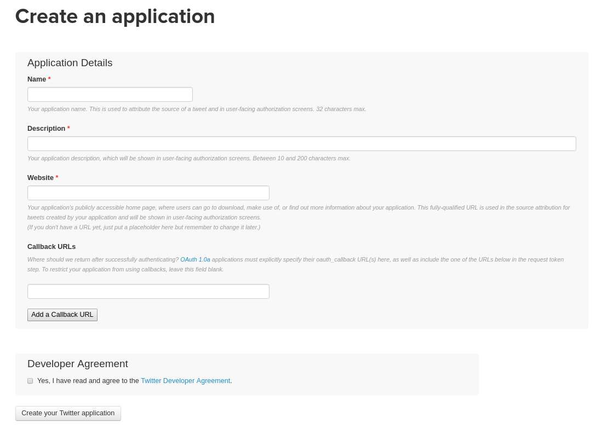
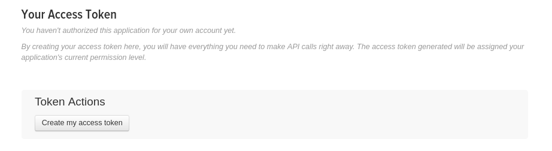

Il y a quelques ~~jours~~ mois, j'ai créé un bot sur twitter, qui répond aux tweets contenant le mot crypter ou cryptage, car rappelons le, ces deux mots ne s'appliquent pas à l'informatique. On parle de chiffrer des données et non pas de crypter des données.

Pour rappel : 

> ## crypter
>
> - **Abusif.** Réaliser le [cryptage](https://www.larousse.fr/dictionnaires/francais/cryptage/20841) de quelque chose. (En informatique, on dit aussi *encrypter*.) [Si l'on veut formellement intégrer la notion de « clé », il est préférable d'utiliser les termes chiffrer et chiffrement.] 

[Définition du larrousse](https://www.larousse.fr/dictionnaires/francais/crypter/20845) 

Le seul cas où on peut utiliser crypter c'est dans le verbe décrypter : 

> Retrouver le sens clair d'un message chiffré en écriture secrète, sans connaître la clef ayant servi à le transcrire.

|        | Avec la clé | Sans la clé |
| ------ | ----------- | ----------- |
| Lire   | Dechiffrer  | Décrypter   |
| Ecrire | Chiffrer    | ?           |

Donc si le verbe crypter existait, il voudrait dire : écrire un message en ecriture secrète sans connaitre la clé ... ça n'a pas beaucoup de sens.

## Le bot

Mon bot twitter s'appelle donc [@cryptagebot](https://twitter.com/cryptagebot) et répond automatiquement à chaque tweet contenant les mots "cryptage" et "crypter". On peut appliquer le même principe à beaucoup d'autres sujets, dans mon cas, ça reste un bot assez simple, mais on peut réaliser des bots bien plus complexe.

Ce bot a été réalisé en python, avec la librairie [tweepy](http://www.tweepy.org). Je vais dans cet article, réaliser un petit guide sur comment programmer un bot twitter.

## Installation

Pour commencer il vous faut un interpréteur python en version 3, dans mon cas j'utiliserai python 3.5.

Je recommande d'utiliser linux pour ce tutoriel, mais cela peut fonctionner sous windows. Si vous êtes sur windows vous pouvez aussi utiliser le Windows Subsystem for Linux ([wsl](https://docs.microsoft.com/en-us/windows/wsl/install-win10)) pour avoir un linux dans votre windows.

### Linux - Ubuntu (& toutes distributions utilisant apt comme gestionnaire de paquets)

Sous linux c'est assez simple.

Depuis un terminal, installation de python3 : 

```bash
sudo apt install python3
```

Vous aurez ensuite besoin de pip le gestionnaire de librairie de python, il est souvent préinstallé avec python mais dans le doute :

```bash
sudo apt install python3-pip
```

Maintenant installons tweepy, pour utiliser twitter depuis python :

```bash
pip3 install tweepy
```

Si vous avez une erreur vous disant que vous n'avez pas assez de permissions, faites :

```bash
pip3 install --user tweepy
```

Et voilà vous avez tout ce qu'il faut pour créer un bot sur Ubuntu.

### Windows

Sur Windows, ça se complique un peu, commencez par télécharger python3 pour windows [ici](https://www.python.org/downloads/) et installez-le.

Déplacez-vous dans le dossier où vous avez installé python et faites :

`shift + click droit -> ouvrir une fenêtre powershell` (sur windows 7 pour les hypsters ça doit etre cmd)

Vous êtes normalement devant un terminal, dans ce terminal powershell tappez : 

```powershell
.\python.exe -m pip install tweepy
```

Et voilà vous êtes prêt

### MacOS

N'ayant pas de Mac, je ne peux pas tester l'installation, mais il faut aussi utiliser pip, pour installer la librairie tweepy.

## Création d'une application twitter

Il faut déjà créer un compte twitter, pour cela il vous faut une adresse mail spécialement pour ce bot. Si vous avez un nom de domaine, créez une adresse mail avec, par exemple "bot_saucisse@jeej.net"

Une fois le compte créé et que vous êtes connecté avec, allez sur : 

https://apps.twitter.com

Vous devrez avoir quelque chose dans ce genre : 


Cliquez sur "create new app"

Remplissez les informations demandées. Pour le website mettez le lien vers le profil twitter de votre bot.



Le champ callback n'est pas important dans notre cas, laissez le vide.


Allez dans Keys and Access Tokens, en bas de la page cliquez sur "Create my access token"



Sur cette page notez votre :

- Consumer Key
- Consumer Secret
- Access Token
- Access Token Secret

Vous aurez besoin de tout ça pour vous connecter à l'api twitter.

## Et maintenant le code !

### Authentification 

Pour commencer, il faut pouvoir se connecter à l'api twitter, pour ça créons une petite fonction nommé "auth", qui va se connecter à l'api.

```python
import tweepy

def auth():
    """
    se connecte à l'api twitter
    """
    # Clés de votre application
    consumer_key = "xxxxxxxxxxxxxxxxxxxxxxxxxx"
    consumer_secret = "xxxxxxxxxxxxxxxxxxxxxxxxxxxxxxxxxxxx"
	
    # le access_token est le token de l'application twitter que nous avons créée précédement
    access_token = "xxxxxxxxxxxxxxxxxxxxxxxxxxxxxxxxxxxxxxxxxxx"
    access_token_secret = "xxxxxxxxxxxxxxxxxxxxxxxxxxxxxxxxxxxxx"
	
    auth = tweepy.OAuthHandler(consumer_key, consumer_secret)
    auth.set_access_token(access_token, access_token_secret)

    api = tweepy.API(auth)
    return api,auth
```

Avec cette fonction vous pouvez maintenant vous connecter à twitter depuis python !

Faites attention avec vos clés et tokens "secret", ils ne doivent surtout pas être publique, ou quelqu'un pourrait usurper l'identité de votre bot. Vous pouvez aussi stocker vos clés dans un fichier et lire ce fichier dans votre fonction auth.

### Envoi d'un simple tweet

Pour faire cela, on va utiliser notre fonction auth et appeler une méthode de l'api :

```python 
import tweepy
import auth # fichier contenant notre fonction auth

api, auth = auth.auth()
api.update_status(status="bonjour depuis python")
```

Et voila, un tweet depuis python.

### Un stream twitter

Un stream twitter est une fonctionnalité de l'api twitter, qui permet de recevoir en temps réel, les tweets postés contenant des mots en particuliers. Dans mon bot par exemple, j'utilise un stream pour recupérer les tweets contenant "crypter" et/ou "cryptage".

Le code : 

```python
from tweepy.streaming import StreamListener
import time
import auth
import json

class listener(StreamListener):

    def on_data(self, data):
        all_data = json.loads(data)

        id_tweet = all_data["id_str"]
        tweet = all_data["text"]
        username = all_data["user"]["screen_name"]
        
        print(username, tweet) # pour afficher les tweets
      
        return True

    def on_error(self, status):
        print(status)

api, auth = auth.auth()

twitterStream = Stream(auth, listener())
twitterStream.filter(track=["saucisse"]) # pour traquer plusieurs mots, faire ["A","B"]
```

Ce stream pour le moment, affiche juste les tweets contenant vos mots clés, mais il affiche aussi les retweets, On va régler ça en testant si le tweet contient le mot RT au début.

Pour cela, on a besoin d'une fonction, qui va tester la présence d'un mot dans une phrase :

```python
def contains_word(string, word):
    return (' ' + word + ' ') in (' ' + string + ' ')
```

Enfin, on teste la présence de "RT" :

```python
if not contains_word(tweet, "RT"):
	print(username, tweet)
```

Avec cette fonction on peut tester d'autre mots dans le tweet, pour affiner les tweets auquels on va répondre.

Une fois toutes les conditions passées, il faut repondre au tweet en question : 

```python
api.update_status(status='@' + username + ' ' + text, in_reply_to_status_id=id_tweet)
```

`text` correspond au message que vous voulez envoyer.

Finalement : 

```python
from tweepy import Stream
from tweepy.streaming import StreamListener
import auth
import json

text = "Je préfère le saucisson"

def contains_word(s, w):
    return (' ' + w + ' ') in (' ' + s + ' ')

class listener(StreamListener):

    def on_data(self, data):
        all_data = json.loads(data)

        id_tweet = all_data['id_str']

        tweet = all_data['text']
        username = all_data['user']['screen_name']
        if not contains_word(tweet, 'RT') and not contains_word(tweet, 'saucisse'):
            print(username, tweet)
            api.update_status(
                status='@' + username + ' ' + text,
                in_reply_to_status_id=id_tweet
            )

        return True

    def on_error(self, status):
        print(status)
        
api, auth = auth.auth()
        
twitterStream = Stream(auth, listener())
twitterStream.filter(track=["saucisse"])
```

Notez que cette version peut planter de temps en temps, pour régler ce problème vous pouvez mettre en place une gestion des exceptions pour gérer les soucis que vous rencontrez. Une autre solution, est de faire un script bash, qui test si le programme a planté et si oui le relance.

Par exemple une petite fonction bash présent dans mon projet [Automation Scripts](https://github.com/pchopinet/Automation-Scripts) :

```bash
sys-process-test(){
    process=$1
    return $(ps xua |  tr -s ' ' | cut -d ' ' -f11 | grep -w $process | wc -l)
}
```

Cette fonction renvoie 0 si aucun programme avec le nom passé en paramètre n'est lancé.

On crée un script qui test le bon fonctionnement du bot et on le lance régulierement via un [crontab](https://doc.ubuntu-fr.org/cron)

Il est aussi possible de mettre en place un conteneur docker pour facilement relancer le bot. Je pense traiter ce sujet dans un article sur la mise en production d'une application python.

### Mise en production basique

Sous un linux, nous allons utiliser : 

```bash
nohup 
```

Cette commande sous linux permet de lancer un programme, de façon qu'il ne soit pas dépendant du terminal avec lequel le programme a été lancé. Comme ça si on ferme le terminal, le programme continue son exécution.

```bash
nohup python3 bot.py &
```

Et voilà, votre bot fonctionne, et ne s'arrêtera pas quand vous fermerez votre console.

Notez que pour tester le bon fonctionnement du programme, vous pouvez juste faire : 

```bash
python3 bot.py
```

## Pour aller plus loin

Notre bot reste basique, il y a de nombreuses façons de l'ameliorer par exemple des filtres plus complexes, une analyse du tweet pour faire des réponses dynamiques, etc...

Lire la doc tweepy : http://tweepy.readthedocs.io/

Lire la doc twitter : https://developer.twitter.com/en/docs/basics/getting-started


Merci de votre lecture et n'hésitez pas à mettre vos bot dans les commentaires de cet article. Vous pouvez aussi partager cet article s'il vous a plu.